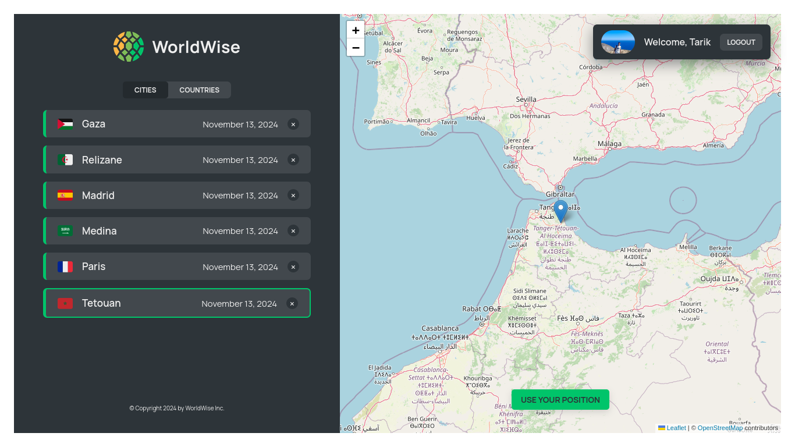

# Worldwise 🌍

A project built while learning **React**, focusing on building interactive and efficient front-end applications. "Worldwise" explores several advanced React features, providing hands-on experience with core concepts and optimizing best practices in modern web development.
Overview

Worldwise is an educational project where I practiced integrating React's powerful tools and libraries to create an application that is both dynamic and responsive. Through this project, I strengthened my understanding of React's ecosystem, component-based structure, and state management strategies.

## Features

- Custom Hooks: Developed reusable hooks to manage stateful logic across components, enhancing modularity and code reusability.
- React Router: Implemented multi-page navigation with React Router to provide a seamless, single-page application experience.
- Context API: Utilized Context API for global state management, enabling efficient data sharing across components without - prop drilling.
- Lazy Loading: Integrated lazy loading to defer loading of components until necessary, optimizing performance and reducing - initial load time.
- CSS Modules: Styled components with CSS Modules for encapsulated, scoped CSS that reduces conflicts and promotes - maintainable, scalable styles.

### Key Learnings

This project provided hands-on experience with:

- Efficient State Management: Leveraging **Context API** and custom hooks to centralize and simplify state management.
- Enhanced Performance: Using **lazy loading** to optimize loading times, especially for larger components.
- Modular CSS Styling: Utilizing **CSS Modules** to create well-organized, reusable styles that are scoped to specific components, - preventing style conflicts.
- Router Integration: Structuring and managing application routes effectively to ensure an intuitive and fluid user experience.

### Getting Started

To run the project locally:

```bash
git clone https://github.com/tarikbenaouda/worldwise.git
cd worldwise
npm install
npm run dev
```

### Technologies Used

- React
- React Router
- Context API
- Custom Hooks
- CSS Modules

## Conclusion

Worldwise served as an excellent learning project for advancing my React skills, equipping me with practical experience in building scalable, performant, and maintainable applications. Through this project, I gained deeper insights into React's design patterns and best practices.

## App View


